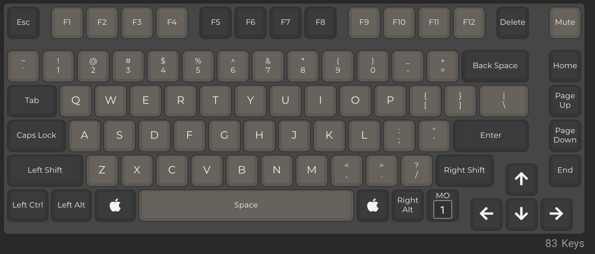

# QMK-Keymaps

My QMK firmware for macOS Keymaps:

## GMMK Pro

Modify from GMMK Pro Standard Layout for macOS by zvuc.

F1 - Monitor Bright Up
F2 - Monitor Bright Down
F3 - Mission Control
F4 - None
F5 - Keyboard Backlight Bright Down
F6 - Keyboard Backlight Bright Up
F7 - None
F8 - None
F9 - Previous Track
F10 - Play/Pause Track
F11 - Next Track

Caps Lock toggle indicator (Caps Lock key and side lights will turn white)

